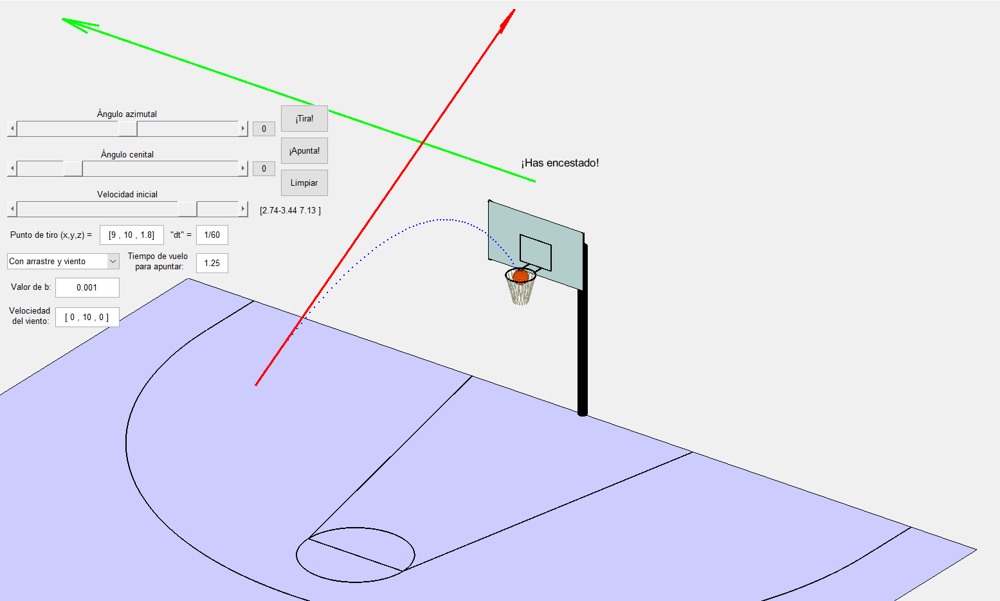

# Canasta: A MATLAB Basketball Physics Simulator

This MATLAB project provides an interactive 3D simulation of a basketball shot. Users can control various physical parameters, such as initial velocity, shooting position, air drag, and wind, to observe different shot trajectories and outcomes.

The simulation features a detailed basketball court, manual and automatic aiming capabilities, and realistic physics modeling for bounces and flight paths.



## Features
- **Interactive 3D Visualization:** A fully rendered 3D basketball court, including the floor, backboard, hoop, and court lines.
- **Manual Shot Control:** Adjust the shot's initial velocity using sliders for:
  - **Speed** (magnitude)
  - **Azimuthal Angle**
  - **Zenith Angle**
- **Customizable Environment:**
  - Set the **shooting position** (x, y, z coordinates).
  - Adjust the simulation's **time step (`dt`)** for finer or coarser calculations.
- **Selectable Physics Models:** Choose the complexity of the simulation:
  1.  **Gravity Only:** A simple parabolic trajectory.
  2.  **Gravity + Air Drag:** Includes a drag force proportional to velocity.
  3.  **Gravity + Air Drag + Wind:** Adds a constant wind force vector.
- **Automatic Aiming (`¡Apunta!`)**: Automatically calculates the perfect initial velocity to make a basket based on a specified flight time.
- **Realistic Bounces:** The ball realistically bounces off the floor and the backboard, with configurable coefficients of restitution.
- **Trajectory Plotting:** The path of the ball is plotted for each shot, which can be cleared at any time.

## How to Run
1.  Make sure you have MATLAB installed.
2.  Open MATLAB.
3.  Navigate to the directory containing the project files.
4.  In the MATLAB Command Window, type the function name `Canasta` and press Enter.

    ```matlab
    >> Canasta
    ```
5.  The simulation window with all the controls will open.

## Controls and UI

#### 1. Initial Velocity
The initial velocity vector is set using spherical coordinates. A red vector on the court visualizes the current setting.
-   **`Ángulo azimutal` (Azimuthal Angle):** A slider to control the horizontal direction of the shot (-180° to 180°).
-   **`Ángulo cenital` (Zenith Angle):** A slider to control the vertical angle of the shot (-90° to 90°).
-   **`Velocidad inicial` (Initial Velocity):** A slider to control the magnitude (speed) of the shot (0 to 20 m/s).
-   **Reset Buttons (`0`):** Buttons next to the angle sliders reset their respective angles to zero.

#### 2. Shooting & Simulation Parameters
-   **`Punto de tiro (x,y,z)` (Shooting Position):** An editable text field to set the ball's starting coordinates. Default: `[0, 7.5, 2]`.
-   **`"dt"`:** An editable text field to set the time step for the simulation loop. Smaller values lead to more accurate but slower simulations. Default: `1/60`.

#### 3. Physics Model
A dropdown menu allows you to select the physical forces to consider in the simulation.
-   **`Sin arrastre del aire` (No air drag):** Only gravity affects the ball.
-   **`Con arrastre del aire` (With air drag):** Adds air resistance. A text box for the drag coefficient `b` will appear.
-   **`Con arrastre y viento` (With air drag and wind):** Adds both air resistance and a constant wind force. Text boxes for `b` and the wind velocity vector `vaire` will appear. A green vector on the court visualizes the wind.

#### 4. Action Buttons
-   **`¡Tira!` (Shoot!):** Starts the simulation with the current parameters. The ball's trajectory will be drawn.
-   **`¡Apunta!` (Aim!):** Automatically calculates and sets the initial velocity required to score a basket. This calculation depends on the selected physics model and the value in the **`Tiempo de vuelo para apuntar` (Flight time for aiming)** text box.
-   **`Limpiar` (Clear):** Clears all previously drawn shot trajectories from the court, resetting the view for a new shot.

## Physics Model Details
The motion of the ball is determined by the selected physics model in the `movimiento` function.
-   **Case 'g' (Gravity):**
    -   Standard projectile motion under a constant gravitational force `g`.
-   **Case 'gr' (Gravity + Resistance):**
    -   Models motion with a linear air drag force `F = -b*v`, where `b` is the drag coefficient.
-   **Case 'grv' (Gravity + Resistance + Wind):**
    -   In addition to the above, it includes a constant force from wind, calculated based on the wind velocity vector `vaire`.
Bounces are handled by reversing the appropriate velocity component and multiplying it by a coefficient of restitution (`es` for the floor, `et` for the backboard).

## Author
This project was created by **Rodrigo Casado Noguerales** (as part of the 1st year course Computational Laboratory of the Double BSc in Mathematics and Physics at Complutense University of Madrid).
